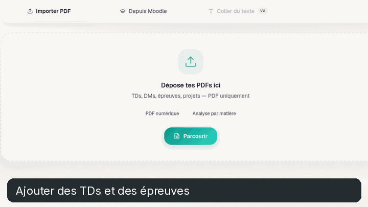

# EntropyOS

An adaptive study planner for science students. Import exercise sheets, organize the work and review at the right time.

**[Explore the live product →](https://www.entropyos.fr/)**

This demo uses the actual application interface with isolated sample exercises. It shows the PDF import screen, the daily plan, an exercise statement, a difficulty choice and the resulting progress. The application source remains private while the product is developed.
